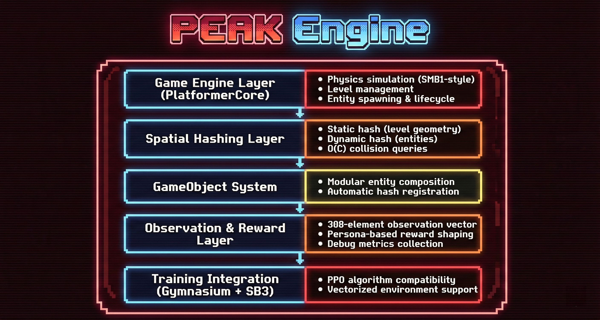
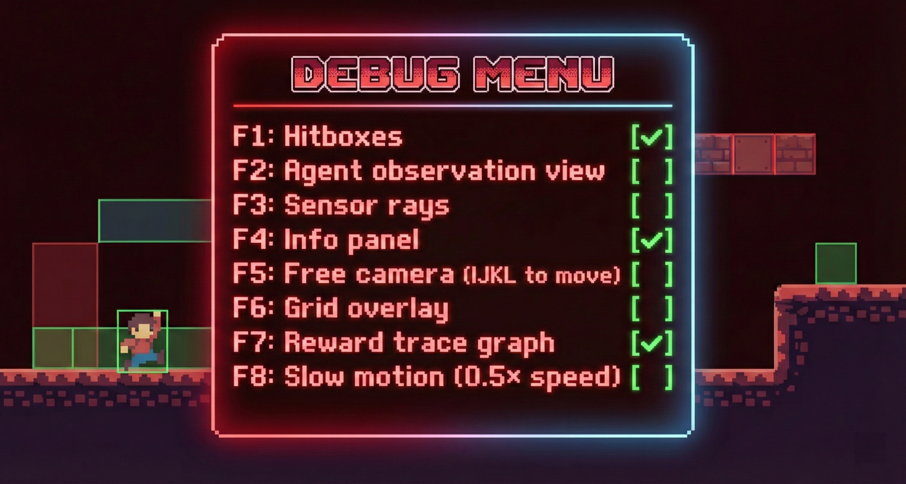

-----
# PEAK: Platformer Engine by Al & Kevin


# PEAK: Platform Engine for Al & Kevin

A deterministic, high-performance reinforcement learning benchmarking engine for evaluating deep RL agent adaptability in 2D platformer environments.

***

## Overview

**PEAK** is a research-grade RL benchmark engine developed for Ontario Tech University's Master's Program. It provides a controlled environment for studying how deep reinforcement learning agents learn, adapt, and generalize in physics-based platformer games.

The engine emphasizes:
- **Vertical progression** through multi-stage level sequences
- **Precision jumping** mechanics requiring spatial reasoning
- **Hazard avoidance** and risk assessment
- **Reproducible physics** for rigorous experimental comparison
- **High-speed training** through optimized collision detection

***
## Key Features

### Core Game Engine

- **Deterministic Physics Simulation**: SMB1-style platformer mechanics with consistent, reproducible behavior across runs
- **Multi-Stage Level Progression**: 11 progressively challenging stages (stage_1.txt through stage_11.txt) designed for skill progression
- **Vertical Platformer Focus**: Emphasis on precision jumping, hazard avoidance, and spatial navigation
- **Interactive Environmental Elements**: Question blocks, spike hazards, collectible coins, power-ups (mushrooms and stars)
- **Dynamic Entity System**: Enemies with AI patrol behavior, collectible items, and interactive obstacles
- **Lives System with Soft Resets**: Agents receive multiple attempts per episode with persistent score tracking across respawns

### Level & Content Management

- **ASCII-based Level Editor**: Simple text file format for level creation (e.g., `#` for ground, `^` for spikes, `G` for goal)
- **11 Built-in Stages**: Increasing difficulty progression from basic platforming to complex multi-level navigation
- **Custom Level Creation Support**: Easy to design and test new levels without code modification
- **Level Parameter Configuration**: Control enemy spawns, coin placement, and environmental hazards via level files

### Agent Environment Interface

- **Gymnasium-Compatible**: Fully compatible with Stable-Baselines3 and other modern RL frameworks
- **Discrete Action Space**: 8 movement actions (idle, left, right, jump, and directional combinations)
- **Rich Observation Vector**: 308-dimensional state representation encoding:
  - Player position and velocity
  - Local 11×9 tile map (what the agent "sees")
  - Nearby entity positions (enemies, coins)
  - Environmental context and progress metrics
- **Configurable Reward Functions**: Multiple "personas" teaching different play styles and priorities

### Reward Shaping System (Personas)

- **Simple Persona**: Gentle progression learning focused on forward movement—good for baseline training
- **Speedrunner Persona**: Aggressive velocity-based rewards for fast level completion—teaches risky, speed-focused play
- **Coin Collector Persona**: Emphasizes exploration and item collection alongside level progression—encourages thorough engagement
- **Master Persona**: Balanced multi-objective learning combining progress, coins, enemies, and goal completion
- **Dynamic Persona Loading**: Reward functions loaded at runtime, enabling easy addition of custom personas

### Performance Optimization

- **Dual Spatial Hashing**: Separate static (level geometry) and dynamic (entity) hash grids achieving O(C) collision detection (where C = local entity density)
- **High-Speed Training**: Enables 1000+ environment steps per second for practical large-scale RL experiments
- **Scalable Physics**: Level complexity does not impact simulation speed—performance depends only on local entity density
- **Deterministic Behavior**: Fully reproducible physics for reliable experimental comparison and result verification

### Training & Configuration Infrastructure

- **Hydra-based Configuration Management**:
  - YAML file definitions for reproducible experiments
  - Command-line parameter overrides for quick experimentation
  - Easy switching between game variants and algorithms
  - Automatic experiment tracking with timestamped outputs

- **Multiple Algorithm Support**:
  - Stable-Baselines3 integration (PPO as primary algorithm)
  - Pluggable architecture for additional algorithms (A2C, DQN, etc.)
  - Unified training interface across different RL methods
  - Algorithm-specific hyperparameter presets

### User Interfaces

**Graphical User Interface (GUI)**
- PyQt5-based Control Center
- Real-time training monitor with TensorBoard integration
- Model selection and evaluation launcher
- Training progress visualization
- Interactive level and persona selection

**Terminal Menu System** (Headless/SSH environments)
- Option 1: Train new model (interactive prompts)
- Option 2: Watch trained agent perform with video recording
- Option 3: View TensorBoard training data
- Option 4: Play game manually (for debugging/understanding)
- Option 5: Maintenance (clean logs/models/videos)

### Debugging & Research Tools

**Real-Time Visualization Suite**
- Hitbox overlays showing collision boundaries
- Spatial grid visualization
- Agent observation rendering (visual representation of 308-element state vector)
- Reward trace graphs tracking real-time reward signals
- Live metrics panel (frame count, score, action taken)

**Interactive Debug Mode**
- Free camera with unrestricted movement (IJKL keys)
- Slow-motion playback (0.5× speed for detailed analysis)
- Real-time input handling with keyboard toggles (F1-F8 keys)

**Comprehensive Logging**
- TensorBoard integration for training curves (rewards, episode length, policy loss)
- Per-step action and reward tracking
- Episode statistics and performance metrics
- Checkpoint system for model persistence and resumption

### Anti-Training Pathology Mechanisms

- **Stall Detection**: Prevents agents from getting stuck in loops or avoiding progress (triggers after 6 consecutive 1.5-second windows without advancement)
- **Progress Tracking**: Monitors both horizontal and vertical advancement independently
- **Backtracking Penalty**: Discourages agents from retreating after making progress
- **Configurable Termination Conditions**: Time limits, pit falls, spike hazards, and goal achievement all customizable

### Game State Management

- **Episode Reset**: Full state restoration between training episodes ensuring clean starts
- **Level Progression**: Agents can advance through multiple stages in sequence with persistent learning
- **Power-Up System**: Temporary state modifiers (invincibility, powered-up status) affecting gameplay
- **Score Accumulation**: Persistent tracking across respawns and level transitions
- **Camera System**: Smooth tracking that keeps the agent centered in the viewport for optimal visibility

### Modularity & Extensibility

- **GameObject Architecture**: Composition-based entity system for easy addition of new game elements (enemies, items, obstacles)
- **Plugin Architecture**: Entities automatically register themselves into spatial hashes without manual management
- **Configurable Parameters**:
  - Player Control Config file: Determines player acceleration, jump mechanics, and movement behavior
  - Physics Engine Config file: Adjustable gravity, friction, and velocity limits
  - ASCII-based Level Generation: Simple text format for level design
  - Map Parameters Config: Colors, tile sizes, and visual properties
- **Modular Reward System**: Add new reward personas without modifying engine code—just add a new function to `code/rewards/platformer.py`

***

## Quick Start

### Installation

```bash
# Clone the repository
git clone https://github.com/Code-SorceryLab/drl-PEAK-agents-balance.git
cd drl-PEAK-agents-balance

# Install dependencies
pip install -r requirements.txt
```

### Training an Agent

**Via GUI**:
```bash
python gui.py
```
Select game parameters, persona, and algorithm, then click Train.

**Via Terminal Menu**:
```bash
python menu.py
```
Follow interactive prompts.

**Via Command Line**:
```bash
python code/scripts/train.py game=platformer persona=simple algo=ppo total_timesteps=1000000
```

### Evaluating a Trained Model

```bash
python code/scripts/evaluate.py --model models/platformer_simple_20250129_143022.zip --render human
```

### Manual Gameplay (for understanding the environment)

```bash
python code/scripts/manual_play.py
```
Use arrow keys to move, spacebar to jump. Press F1-F8 to toggle debug overlays.

***

## Architecture


### Layer 1: Physics Engine
Implements deterministic SMB1-style platformer physics with acceleration-based movement, variable jump height, gravity, and friction.

### Layer 2: Spatial Hashing
Optimizes collision detection by dividing the world into grid cells. Static geometry (level tiles) is hashed once; dynamic entities (enemies, coins) are rehashed each frame.

### Layer 3: GameObject System
All game entities (player, enemies, coins, powerups) wrap a unified `GameObject` data structure, enabling automatic hash registration and consistent physics.

### Layer 4: Observation & Reward
Extracts game state into a 308-element vector and applies persona-based reward shaping to guide agent learning.

### Layer 5: Training Integration
Gymnasium-compatible interface plugs directly into Stable-Baselines3 for seamless RL training and evaluation.


***

## Configuration

All settings are defined in YAML files and can be overridden via command line:

```yaml
# Example: code/conf/game/platformer.yaml
world: "1-1"
speed_mult: 2.0
max_steps: 4000
use_timer: true
timer_seconds: 400
debug_default: false

# Example: code/conf/reward/platformer_simple.yaml
forward_weight: 10.0
coin_bonus: 5.0
death_penalty: -100.0
```

Override at runtime:
```bash
python train.py game=platformer persona=speedrunner timer_seconds=300
```

***

## Levels

Levels are defined in ASCII text files (`code/games/levels/stage_*.txt`):

```
##################  (# = solid ground)
#                #
#   =====        #  (= = platform)
#   #   #        #
# P#   #     G   #  (P = player start, G = goal)
#  # C #        ##
#  ### ##########
^^^^^^^^^^^^^^^^^^  (^ = spike hazard)
```

Characters:
- `#` = Solid ground (walkable)
- `=` = Platform (one-way or normal)
- `G` = Goal tile (level completion)
- `^` = Spike hazard (instant death)
- `?` = Question block (hit from below for coin/powerup)
- `C` = Coin (collectible item)
- `E` = Enemy (patrol AI)
- `P` = Player spawn position

***

## Personas Explained

Each persona teaches a different play style through reward shaping:

| Persona | Focus | Best For |
|---------|-------|----------|
| **Simple** | Steady forward progress + basic rewards | Learning baseline skills |
| **Speedrunner** | Maximum velocity + minimal penalty | Learning aggressive, fast play |
| **Coin Collector** | Thorough exploration + item collection | Learning complete level traversal |
| **Master** | Balanced all objectives | Learning well-rounded gameplay |

Train the same agent with different personas to study how reward design shapes behavior.

***

## Research Use Cases

### 1. Reward Shaping Impact
Train identical agents with different personas and measure learning curves, final performance, and play style. Quantify the trade-offs between aggressive and conservative reward functions.

### 2. Transfer Learning
Train on stages 1-5, test on stage 6 (unseen). Measure generalization and understand what skills agents actually learn.

### 3. Physics Sensitivity
Train two agents with slightly different jump heights or gravity and measure the impact on learning. Reveal which physics parameters matter most.

### 4. Agent Analysis
Use debug visualizations to understand what observations agents use, why they make certain decisions, and where they fail.

***

## Performance Metrics

PEAK achieves:
- **1000+ steps/second**: Practical for 10M+ step experiments
- **Full Determinism**: Identical seeds = identical results
- **Memory Efficient**: Spatial hashing uses only occupied cells
- **Scalable**: Level size doesn't affect performance (only entity density)

***

## Contributing

To add a new reward persona:
1. Create a function in `code/rewards/platformer.py`
2. Use the `@_wrap_with_tracker` decorator
3. Return a float reward value
4. Add YAML config in `code/conf/reward/`

To create a new level:
1. Create a `.txt` file in `code/games/levels/`
2. Use ASCII characters as described above
3. Load it via CLI or configuration

***

## Debugging

Run in human mode to see real-time visualizations:
```bash
python code/scripts/manual_play.py
```

Toggle debug features with keyboard:
- `F1`: Hitboxes
- `F2`: Agent observation view
- `F3`: Sensor rays
- `F4`: Info panel
- `F5`: Free camera (IJKL to move)
- `F6`: Grid overlay
- `F7`: Reward trace graph
- `F8`: Slow motion (0.5× speed)



***
## Authors

- **Al (AI-Scripting)**: https://www.linkedin.com/in/al-mohamed-shifan-5266b924b/
- **Kevin Chu**: https://www.linkedin.com/in/kevincchua/

Ontario Tech University, Master's Program

***

## Acknowledgments

Built on Gymnasium (OpenAI) and Stable-Baselines3 (DRL-LaB).