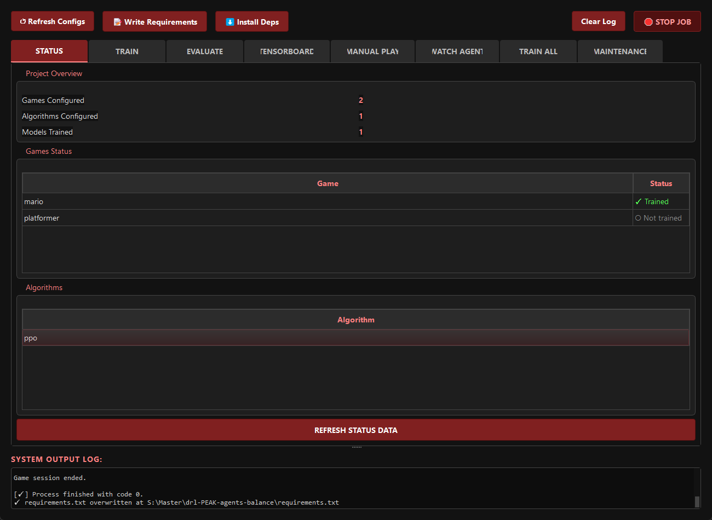
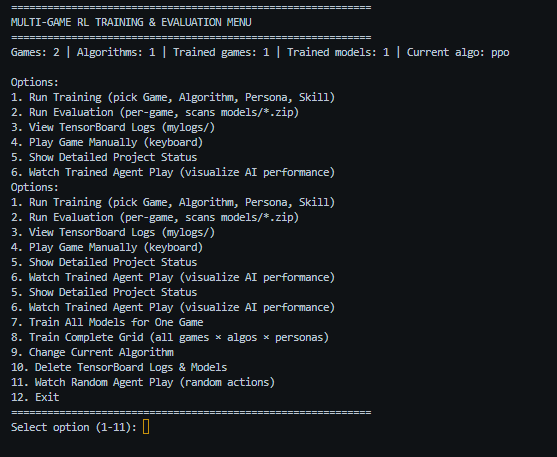

-----
# PEAK: Platformer Engine by Al & Kevin


**PEAK** is a specialized Deep Reinforcement Learning (DRL) framework designed to benchmark agent adaptability in 2D platforming environments. Built on a custom-engineered Pygame engine, PEAK provides a high-performance, deterministic environment for training agents using Stable-Baselines3.

Unlike standard Gym wrappers for emulators, PEAK offers a clean codebase with a modular "Persona" system for reward shaping, allowing researchers to investigate how different incentive structures affect agent behavior in complex navigation tasks.

## 🎯 Key Features

  - **Custom Physics Engine**: A deterministic SMB1-style physics core (`MarioCore` & `PlatformerCore`) built from scratch in Python.
  - **Dual Spatial Hashing**: Implements a broad-phase collision optimization system separating static geometry from dynamic actors (O(1) lookups), ensuring high FPS during accelerated training.
  - **Persona System**: Modular reward shaping strategies (e.g., `Explorer`, `Speedrunner`, `Momentum`) to test agent generalization and overcome local optima like "stutter-stepping" or pit-stalling.
  - **PEAK Control Center**: A PyQt5 GUI for managing training sessions, evaluating models, and visualizing TensorBoard logs in real-time.
  - **Anti-Stall & Backtracking**: Built-in logic to penalize agents for camping or getting stuck in loops, forcing exploration.

## 📁 Repository Structure

Based on the current project layout:

```text
drl-PEAK-agents-balance/
├── code/
│   ├── conf/                  # Hydra configurations (Grid, Algo, Rewards)
│   ├── games/                 # Game Logic
│   │   ├── mario_core.py      # SMB1-style environment
│   │   └── platformer_core.py # Vertical/Technical platformer
│   ├── modules/               # Engine Internals (SpatialHash, Physics, Tile)
│   ├── rewards/               # Reward Shaping Functions (Personas)
│   │   ├── mario.py
│   │   └── platformer.py
│   └── scripts/               # Training & Eval entry points
├── models/                    # Saved Checkpoints
├── mylogs/                    # TensorBoard Logs
├── gui.py                     # PEAK Control Center (GUI)
├── menu.py                    # CLI Menu Fallback
└── requirements.txt           # Dependencies
```

## 🚀 Quick Start

### 1\. Installation

```bash
# Create virtual environment
# Linux
python -m venv venv
source venv/bin/activate  # Windows: venv\Scripts\activate

# Install dependencies
pip install -r requirements.txt
```

### 2\. Launching PEAK

The recommended way to use the framework is via the GUI Control Center:

```bash
python gui.py
```





This interface allows you to:

  * **Status**: View trained models and configuration status.
  * **Train**: Select Game (Mario/Platformer), Algo (PPO), and Persona to start training.
  * **Evaluate**: Run inference on trained models to visualize performance.
  * **Maintenance**: Clean up logs and old checkpoints.

Alternatively, use the CLI menu:

```bash
python menu.py
```




## 🎮 Environments

PEAK currently supports two distinct core environments:

### 1\. MarioCore

A horizontal scrolling environment mimicking *Super Mario Bros (NES)* mechanics.

  * **Features**: Goombas, Breakable Bricks, Question Blocks (Coins/Mushrooms/Stars), and Flagpole goals.
  * **Goal**: Reach the rightmost side of the level.

### 2\. PlatformerCore

A verticality-focused environment emphasizing precise jumping mechanics.

  * **Features**: One-way platforms, spikes, and complex vertical geometry.
  * **Goal**: Navigate complex terrain to reach the specific goal tile.

## 🧠 Personas & Reward Shaping

PEAK utilizes a "Persona" system to define agent objectives. These are defined in `code/rewards/`:

| Persona | Description | Key Metric |
| :--- | :--- | :--- |
| **Baseline** | Random noise reward for sanity checking. | N/A |
| **Simple** | Gentle forward shaping with small bonuses for coins/kills. | `dx` |
| **Speedrunner** | High negative bias per step, massive reward for velocity. Encourages risky play. | `velocity_x` |
| **Collector** | Prioritizes complete coin collection over speed. | `coins_collected` |
| **Explorer** | **Solves the "Pit Problem"**. Only rewards pushing the "frontier" (max X achieved). | `frontier_dx` |
| **Momentum** | Penalizes low velocity to prevent "stutter-stepping" behavior. | `norm_v` |
| **Master** | A carefully balanced mix of all objectives for optimal play. | Composite |

## ⚙️ Engine Architecture: Spatial Hashing

To support DRL training speeds (thousands of steps per second), PEAK avoids standard O(N²) collision checks. Instead, it uses a **Dual Spatial Hash** architecture:

1.  **Static Hash**: Contains level geometry (walls, floors). Built once at level load. Read-only.
2.  **Dynamic Hash**: Contains active entities (enemies, coins). Rebuilt every frame.

This allows the engine to query only relevant physics bodies within the agent's immediate vicinity, drastically reducing CPU overhead.

## 🛠️ Configuration

PEAK uses **Hydra** for configuration management. All hyperparameters can be tuned in `code/conf/`:

  * `grid.yaml`: Defines available models and environments.
  * `algo/`: PPO/DQN hyperparameters (learning rate, batch size).
  * `reward/`: Weights for specific personas (e.g., `mario_speedrunner.yaml`).

## 🤝 Credits

**PEAK** (Platformer Engine by Al and Kevin)

  * **Lead Researcher's & Developer's**: Al Shifan & Kevin Chua
