<p align="center">
  
</p>

<h3 align="center">Evolved neural agents as tireless playtesters for 2D platformers</h3>

<p align="center">
  
  
  
  
  
  
</p>

<p align="center">
  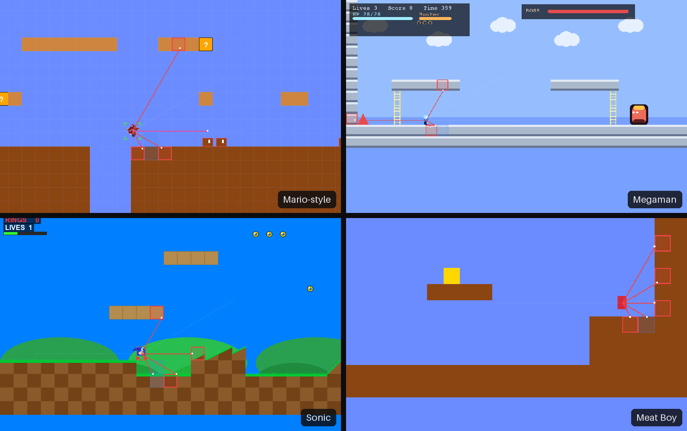
</p>
<p align="center"><sub>Four hand-written engines, one probe. The red fan is what the agent sees: six raycasts, a pit probe and an enemy corridor — 14 numbers into a 291-weight network.</sub></p>

**PEAK** is a game-balancing engine built for Ontario Tech University's Master's program. Instead of
asking humans to play a level a thousand times, it evolves populations of tiny neural networks
(14 → 16 → 3, no gradients, no GPU) that play it for you and report back: win rate with confidence
intervals, generations-to-first-win, where and why they die, which routes they find. Same seed,
same run — bit for bit.

> The previous deep-RL (stable-baselines3 PPO) version is preserved on the `archive/drl-sb3-final` branch.

---

## See it work

<table>
  <tr>
    <td width="50%" align="center">
      <br>
      <sub><b>The first win.</b> A population of ten discovers Mario 1-1's exit, captured live during evolution.</sub>
    </td>
    <td width="50%" align="center">
      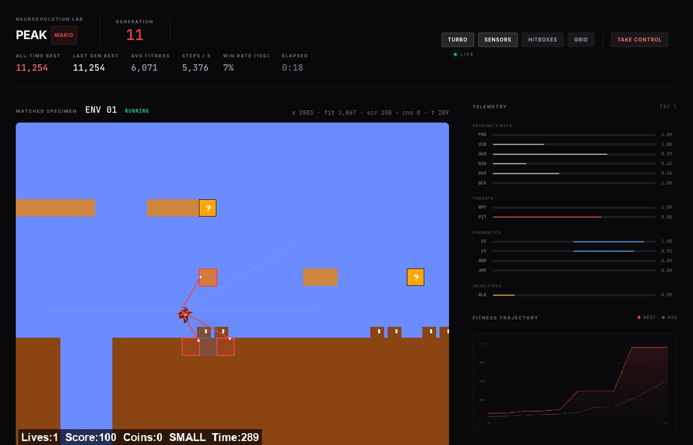<br>
      <sub><b>Live dashboard</b> (menu 11). Watched specimen with sensors, per-input telemetry, fitness trajectory, 5k+ steps/s in Turbo.</sub>
    </td>
  </tr>
  <tr>
    <td align="center">
      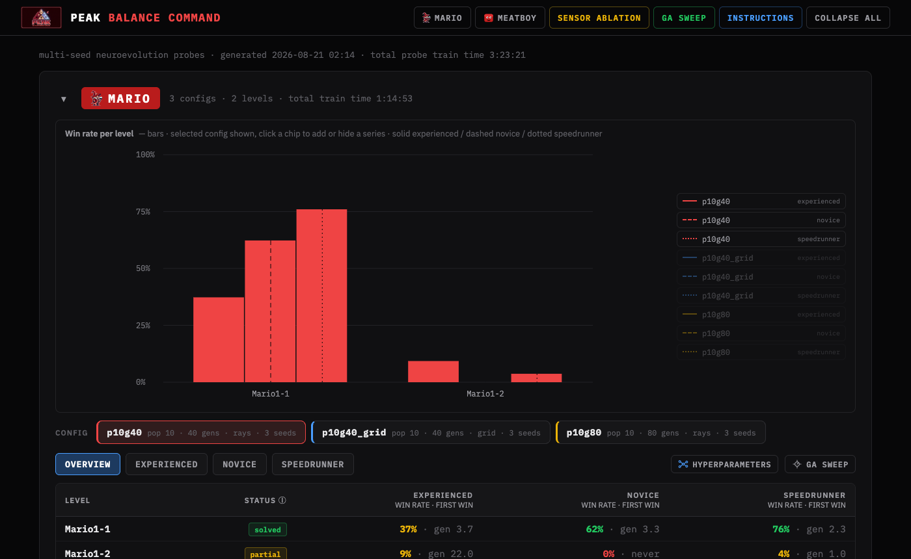<br>
      <sub><b>Balance Command center</b> (menu 12). Every probe on disk: win rate per level per persona, one HTML file.</sub>
    </td>
    <td align="center">
      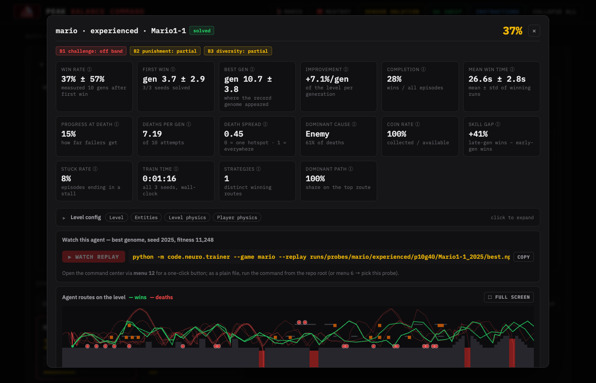<br>
      <sub><b>Level dialog.</b> 16 metrics with B1/B2/B3 bands, death heatmap, agent routes on the level, and a ▶ Watch button that replays the best genome.</sub>
    </td>
  </tr>
  <tr>
    <td align="center">
      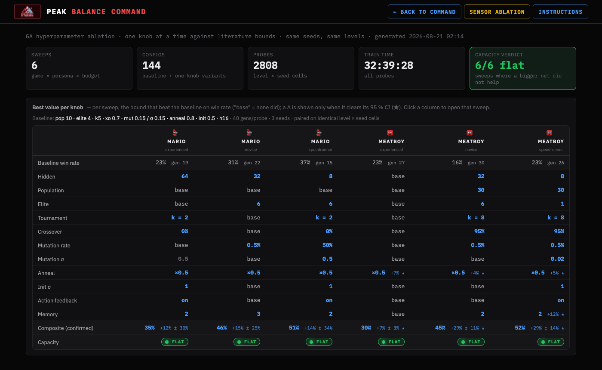<br>
      <sub><b>GA sweep page</b> (menu 15). Which hyperparameter beat the baseline, per game and persona, paired on identical seeds.</sub>
    </td>
    <td align="center">
      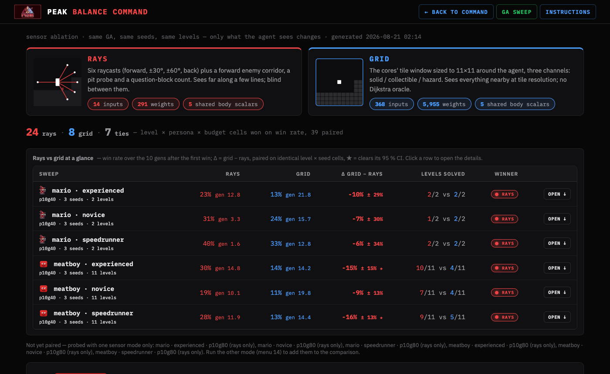<br>
      <sub><b>Sensor ablation</b> (menu 14). Rays (14 inputs) vs tile grid (368 inputs) under identical GA, seeds and levels.</sub>
    </td>
  </tr>
</table>

---

## What the probes found

Everything below comes straight out of `runs/balance/*.json` — the same data the command center renders.

<p align="center">
  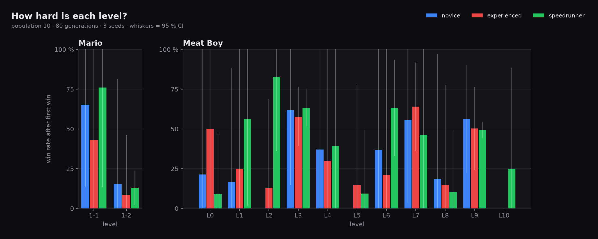
</p>

**Levels rank themselves.** Mario 1-1 is solved by every seed and persona; 1-2 is cracked by one seed
in three for novice and experienced, and its win rate collapses below 15 % for all three. Meat Boy's
eleven levels spread from "every seed, every persona" (L3, L9) to a level only the speedrunner solves
(L10) — and that sprinting persona is the *worst* on L0 yet the best on L1 and L2. That spread is the
design signal the tool exists to produce.

<table>
  <tr>
    <td width="50%">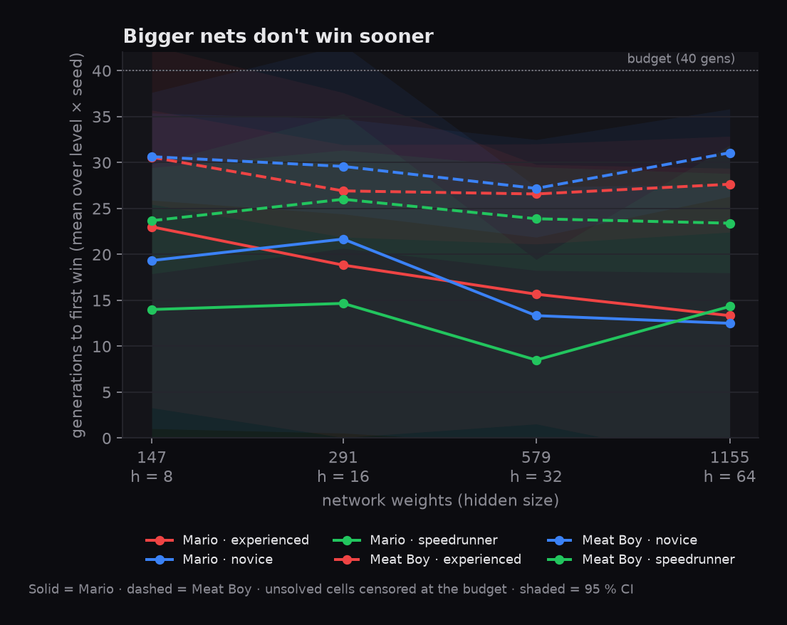</td>
    <td width="50%">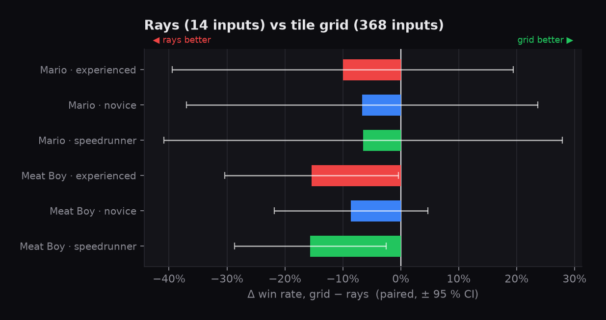</td>
  </tr>
  <tr>
    <td><sub><b>Bigger nets don't win sooner.</b> Hidden size 8 → 64 (147 → 1,155 weights) leaves generations-to-first-win flat in all six sweeps. The bottleneck is the level, not the brain.</sub></td>
    <td><sub><b>Fourteen rays beat 368 grid cells.</b> The tile-grid sensor loses in all six sweeps (★ = clears its 95 % CI). More input is more weights to evolve, not more insight.</sub></td>
  </tr>
</table>

<p align="center">
  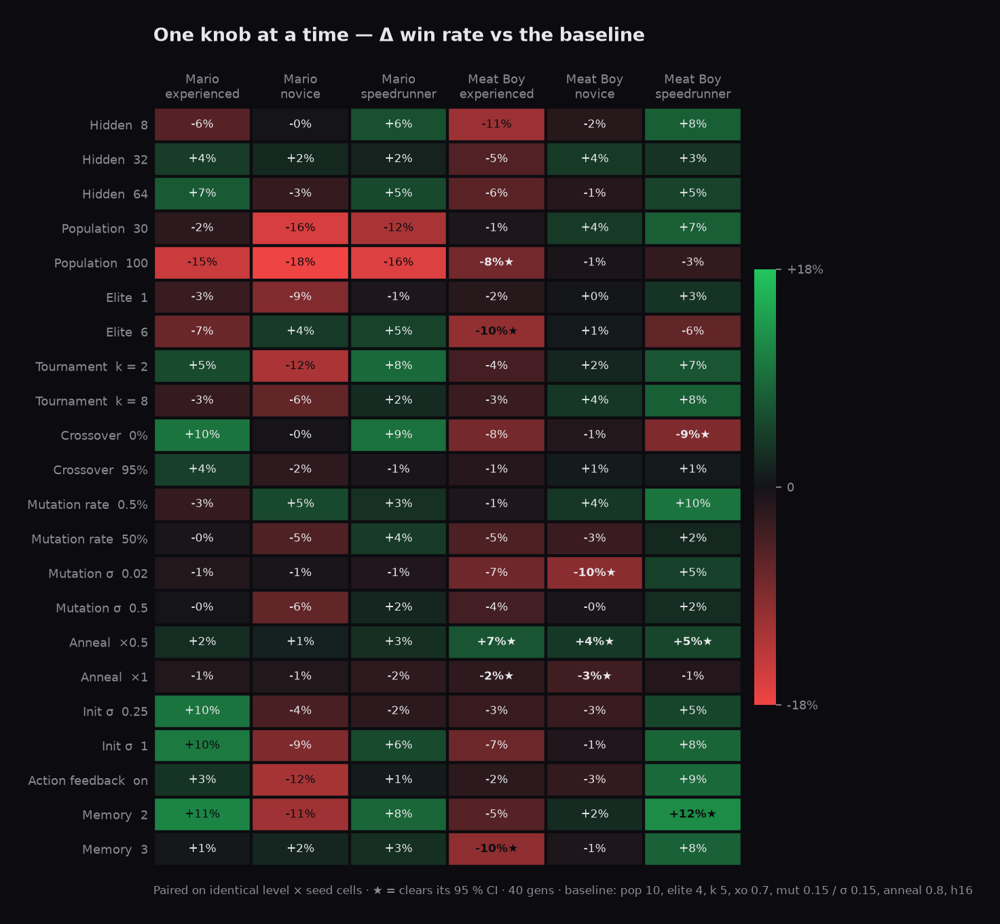
</p>

**One knob at a time.** 22 variants × 6 sweeps, each moved to its literature low or high bound
(De Jong, Grefenstette, Miller & Goldberg, Such et al.). Only one change wins everywhere:
annealing mutation ×0.5 after the first win — now the default. Population 100 is worse in 6/6
(same budget in generations, ten times the compute); elite 6, σ 0.02 and no crossover each hurt a
Meat Boy persona significantly; memory units only clear the noise for the sprinting speedrunner.

---

## Quick start

```bash
git clone https://github.com/Code-SorceryLab/PEAK-DRL-Tool.git
cd PEAK-DRL-Tool
pip install -r requirements.txt
python menu.py
```

The menu drives everything — train, watch, play, edit levels, run probes, open the command center:

| | Train | | Play | | Tools & balance |
|--:|---|--:|---|--:|---|
| 1 | Project status | 5 | Play manually (any game / level) | 9 | Level editor |
| 2 | Train single (game · level · persona · sensors) | 6 | Watch a trained agent | 10 | Toggle levels |
| 3 | Train all levels of one game | 7 | Watch all envs (dashboard grid) | 11 | Live dashboard |
| 4 | Train the full game × level grid | 8 | Watch a random agent | 12 | Balance Command center |
| | | | | 13 | Full sweep (games × personas × seeds) |
| | | | | 14 | Sensor ablation (rays vs grid) |
| | | | | 15 | GA sweep (one knob at a time vs literature bounds) |

<details>
<summary><b>Command line equivalents</b></summary>

```bash
# Train — dashboard at http://127.0.0.1:8000/<game>/index.html
python -m code.neuro.trainer --game mario                              # curriculum over enabled levels
python -m code.neuro.trainer --game mario --level Mario1-2 --turbo     # one level, max speed
python -m code.neuro.trainer --game sonic --persona speedrunner         # novice / experienced / speedrunner
python -m code.neuro.trainer --game megaman --sensors grid --seed 7     # tile-grid sensors, custom seed
python -m code.neuro.trainer --game mario --hidden 32 --memory 2       # bigger net, 2 Jordan memory units
python -m code.neuro.trainer --resume runs/mario                       # continue a run
python -m code.neuro.trainer --game mario --replay runs/mario/best.npz # watch the all-time best

# Probe — every enabled level × 3 seeds, parallel across cores
python -m code.neuro.balance --game mario --gens 40 --persona experienced
python -m code.neuro.balance --game mario --gens 40 --sensors grid
python -m code.neuro.balance --game mario --compare                    # rays-vs-grid table, no training
python -m code.neuro.gasweep --game mario --gens 40 --axes hidden memory --confirm

# Report
python -m code.neuro.report --serve --open                             # command center (▶ Watch needs --serve)
streamlit run code/stats/dashboard/app.py                              # B1/B2/B3 stats dashboard

# Play
python -m code.games.tools.manual_play --game platformer --level Mario1-2
python -m code.games.tools.manual_play --game meatboy --level 3        # Meat Boy levels are indices
```

`A`/`D` or arrows move, `Shift` run, `Space`/`W` jump, `Z` fire (Mario / Megaman), `W`/`S` climb
(Megaman), `S` roll (Sonic), `Esc` quits. `F1` rays · `F2` free camera (`IJKL`) · `F3` slow motion ·
`F4` hitboxes · `F5` agent max view.
</details>

---

## How it works

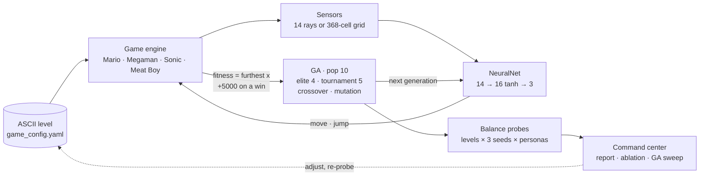

| Layer | Where | What it does |
|---|---|---|
| Engines | `code/games/*_core.py` | Four deterministic Pygame platformers sharing ASCII level loading and debug tooling |
| Adapters | `code/neuro/adapters.py` | One `GameAdapter` face per engine: reset, step, solid/hazard queries, fitness, episode stats |
| Sensors | `code/neuro/sensors.py` | Raycast marching + scalar senses → 14 floats; or a 3 × 11 × 11 tile window + body senses → 368 |
| Evolution | `code/neuro/evolution.py` | `GAConfig` + `Population`: flat weight vectors, elitism, tournament, uniform crossover, gaussian mutation, checkpoints with RNG state |
| Trainer & dashboard | `code/neuro/trainer.py` · `server.py` · `web/index.html` | Ten envs stepped round-robin in one process; websocket dashboard with live frames, telemetry, manual takeover |
| Balance | `code/neuro/balance.py` · `gasweep.py` · `report.py` | Multi-seed probes, GA hyperparameter sweep, self-contained HTML command center |
| Stats | `code/stats/dashboard/` | Streamlit B1 challenge / B2 punishment / B3 diversity calibration over the episode CSVs |

**Why neuroevolution.** A 291-weight reactive policy has no replay buffer, no optimizer, no value
head and no GPU. The whole population plays one level simultaneously, each genome in its own
engine instance, at 5,000+ env-steps/s on a laptop. A 2-level × 3-seed × 40-generation Mario probe
costs about six CPU-minutes; Meat Boy's eleven levels about ten. And because one seed drives
population init, mutation and every game step, two runs with the same seed are identical — the
probe is a frozen, repeatable playtester you can diff level designs against.

---

## Features

<table>
<tr>
<td width="50%" valign="top">

**Neuroevolution core**
- Fixed-topology GA over a numpy MLP; hidden size, last-action feedback and Jordan memory units are `GAConfig` knobs (`--hidden`, `--action-feedback`, `--memory`)
- 14-sensor perception: six raycasts (forward, forward-up ±30°/60°, forward-down ±30°/60°, back), enemy corridor, pit probe, velocity, grounded / can-jump, nearby question blocks
- Two sensor modes, `rays` (14) or `grid` (368), switchable per run
- Fitness = furthest x reached, +5000 on a win, + time left × persona bonus; Meat Boy uses BFS path progress
- Curriculum: the population advances to the next enabled level after three winners in one generation
- Full determinism from one seed

**Player personas** (`code/neuro/personas.py`)
- **Novice** — fresh senses every 3rd frame, walking pace
- **Experienced** — default reactions and movement
- **Speedrunner** — sprint plus 25 fitness per second left

</td>
<td width="50%" valign="top">

**Balance & analytics**
- Per (level × seed) fresh populations → win rate ± 95 % CI, generations-to-first-win, dominant death cause, trend; hardest levels ranked first
- `--workers N` spreads probes across cores (default cores − 1)
- Per-episode CSVs: persona, cause of death, jumps, coins, velocity, progress at death, sampled route
- Command center: per-game sections, radar, level dialogs with death heatmaps, routes, per-seed learning curves, the exact GA config, ▶ Watch replays
- Rays-vs-grid ablation page; GA sweep page with capacity curve, per-axis bound tracks and a recommended config per game (`--confirm` probes it)

**Live dashboard**
- Grid of all ten envs with per-env HUD; large watched view with rays, hit dots, tile outlines, pit-probe boxes
- Telemetry bars, fitness chart, per-generation ledger
- Turbo (headless max speed), hitbox and grid overlays, level switching at the next generation
- **Take control**: drive the watched env yourself while the other nine keep evolving
- Frame encoding is skipped entirely while no browser tab is connected

</td>
</tr>
</table>

---

## Configuration

| Knob | Where | What it changes |
|---|---|---|
| GA hyperparameters | `GAConfig` in `code/neuro/evolution.py` | population 10 · elite 4 · tournament k 5 · crossover 0.7 · mutation rate 0.15 / σ 0.15 · init σ 0.5 · anneal ×0.5 after a level's first win (the sweep's one universal winner) · 3600-frame episodes · 300-frame stall kill · advance after 3 wins · win bonus 5000 · seed 42 · hidden 16 · feedback off · memory 0 |
| Network shape | `--hidden / --action-feedback / --memory`, `code/neuro/net.py` | 147 / 291 / 579 / 1,155 weights for hidden 8 / 16 / 32 / 64; +2 inputs with feedback; +N in/out with memory |
| Sensors | `--sensors rays\|grid`, `code/neuro/sensors.py` | ray angles, max distance 250 px, march step 8 px, pit-probe depth 4 tiles, grid half-width 5 |
| Personas | `code/neuro/personas.py` | sprint, sensor reaction period, time-left bonus — one dataclass per persona |
| Levels | `code/games/levels/<game>/*.txt` + `game_config.yaml` / `meatboy_config.yaml` | ASCII tilemaps; enable/disable per level; the trainer re-reads the list every generation |
| Game feel | per-game blocks in `game_config.yaml`, `meatboy_config.yaml` | gravity, jump velocity, run speed, coyote frames, wall-jump forces, per-level `time_limit` |
| Balance probes | `code/neuro/balance.py` | seeds 1234 / 2025 / 31337 (keep for comparability), gens budget, `--workers` |
| Stats bands | `code/stats/MarioThresholds.yaml` | B1 / B2 / B3 target bands and warning margins |
| Dashboard | `--port` (HTTP 8000), websocket 8765 | thumbnails 5 fps (1 in Turbo), watched env 20 fps |

Deep dives: [`docs/GUIDE.md`](docs/GUIDE.md) (how the system works) and
[`docs/BALANCE.md`](docs/BALANCE.md) (every metric, the personas, the GA-sweep bounds and citations,
related work).

---

## Levels

Levels are ASCII files in `code/games/levels/<game>/` — paint them in the editor (menu 9) or by hand:

```
##################      #  solid ground          ?  question block (coin)
#                #      =  one-way platform      C  coin
#   =====        #      ^  spikes                E  enemy
#   #   #        #      G  goal                  P  player spawn
# P#   #     G   #
#  # C #        ##      springs, saws, crumble blocks, slopes, ladders, power-ups
#  ### ##########       and per-game entities: code/games/levels/common/ASCII_TILEMAP.md
^^^^^^^^^^^^^^^^^^
```

Register a new file in `game_config.yaml` (or `meatboy_config.yaml`'s list) and the trainer picks it
up at the next generation — no restart.

---

## Research use

| Question | What to run | What to read |
|---|---|---|
| How hard is each level, and for whom? | menu 13 (full sweep) | win rate ± CI and first-win per level × persona; unsolved-at-budget levels flag sealed goals and mechanic-gated paths |
| *Why* is it hard? | any probe → level dialog | death causes (Pit / Stall / Enemy / OOB / Spike), 10-bin death heatmap, route overlay |
| Did my edit help? | edit → menu 13 again | same seeds, same GA — the probe is frozen, so the diff is the level |
| How much skill does the design reward? | menu 13, compare personas | novice vs speedrunner completion on the same level (`skill gap` tile) |
| Is the agent the bottleneck? | menu 14 + 15 | rays vs grid, hidden 8 → 64, memory units — if all flat, it's the level |

---

## Tests

```bash
python -m pytest code/tests -q
```

35 tests: GA determinism (seeded mutation, crossover, elitism), net parameter counts and the
feedback/memory carry, raycasts and the tile grid on synthetic levels, headless adapter and trainer
smoke tests, balance-probe aggregation, and the GA-sweep config / tag / verdict logic.

Known wart: the top-level package is named `code`, which shadows a stdlib module. Renaming it
touches every import under `code/games/` and hasn't been worth the churn.

---

## Authors

**Al (AI-Scripting)** · [LinkedIn](https://www.linkedin.com/in/al-mohamed-shifan-5266b924b/)  
**Kevin Chu** · [LinkedIn](https://www.linkedin.com/in/kevincchua/)

Ontario Tech University, Master's Program. Game engines, evolution system and dashboards built from
scratch in Python + Pygame + numpy; stats-dashboard metrics designed with Amr Abdalla's
statistics-observer work.
