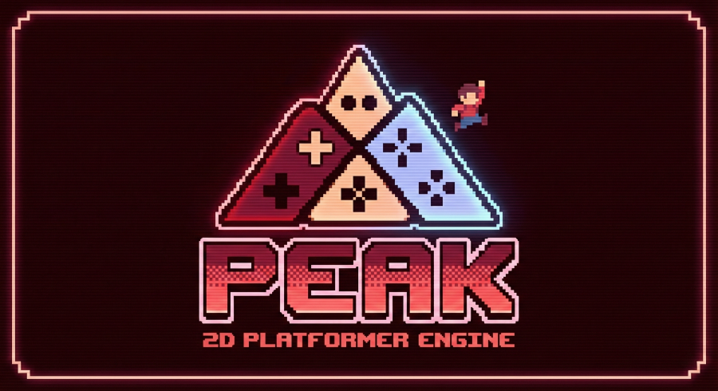
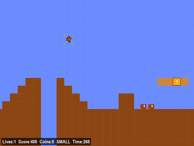

-----
# PEAK: Platformer Engine by Al & Kevin

<p align="center">
  
</p>

<p align="center">
  
</p>

<p align="center">
  
  
  
  
  
</p>

A deterministic, high-performance **game-balancing engine** that uses evolved neural agents as
tireless playtesters across 2D platformer environments.

***

## Overview

**PEAK** is a research-grade balance-testing engine developed for Ontario Tech University's
Master's Program. It provides a controlled environment for studying how level design shapes
difficulty — measured by populations of tiny evolved neural networks that play the levels
thousands of times and report back.

The engine emphasizes:
- **Agents as difficulty probes** — win rates, failure modes, and death maps per level
- **Neuroevolution over deep RL** — ~290-parameter reactive policies, no gradients, no GPU
- **Reproducible evolution** — same seed, same run, step for step
- **Designer-in-the-loop workflow** — author a level, play it, train on it, read the report
- **Four game engines, one probe** — Mario-style, Megaman, Sonic, and Meat Boy

> The previous deep-RL (stable-baselines3 PPO) version of this repo is preserved on the
> `archive/drl-sb3-final` branch.

***

## Watch It Evolve

<p align="center">
  
</p>

<p align="center"><i>The population's first Mario 1-1 win, captured live during evolution —
a 291-parameter network that learned this from raycasts and a distance score.</i></p>

***

## Key Features

### Neuroevolution Core

- **Fixed-Topology GA**: numpy MLP (14 → 16 tanh → 3 sigmoid, 291 weights at the default size) evolved by
  elitism, tournament selection, uniform crossover, and gaussian mutation; hidden size, last-action
  feedback, and Jordan memory units are `GAConfig` knobs (`--hidden`, `--action-feedback`, `--memory`)
- **14-Sensor Perception**: six raycasts (forward, back, ±30°, ±60°), forward enemy distance,
  pit probe, velocity, grounded/jump state, nearby question blocks
- **Two Sensor Modes**: `rays` (14 inputs, default) or `grid` — a 3×11×11 tile window plus
  body senses (368 inputs) — switchable with `--sensors`, compared head-to-head by the
  Sensor Ablation sweep (menu 14)
- **10 Parallel Simulations**: the whole population plays the same level simultaneously,
  each genome in its own game instance
- **Distance Fitness + Win Bonus**: fitness = furthest x reached (+5000 on a win);
  Meat Boy uses BFS path progress instead
- **Full Determinism**: one seed drives population init, mutation, and every game step

### Balance & Analytics Pipeline

- **Multi-Seed Balance Probes**: per (level × seed) fresh populations report win rate ± 95% CI,
  generations-to-first-win, dominant death cause, and trend — hardest levels ranked first
- **Parallel Probing**: `--workers N` spreads probes across CPU cores (default: cores − 1)
- **Per-Episode CSVs**: every run logs persona, cause of death, jump count, coins, avg velocity,
  progress at death, and a sampled (x, y) route trace
- **Stats Dashboard (Streamlit)**: B1 challenge calibration, B2 punishment severity, B3 strategy
  diversity (route clustering), win rate by persona, and route overlays drawn on the level grid
- **Balance Command Center** (menu 12): one self-contained HTML report over every run and
  probe on disk — per-game sections, balance radar, level cards that open into dialogs with
  death heatmaps, cause bars, per-seed learning curves, the exact GA hyperparameters used, and
  ▶ Watch buttons that launch replays
- **Rays vs Grid Ablation**: the same sweep run under both sensor modes, with per-level
  learning overlays and a comparison page
- **GA Hyperparameter Sweep** (menu 15): one `GAConfig` knob at a time moved to its literature
  low and high bound (De Jong, Grefenstette, Schaffer, Miller & Goldberg, Such et al.) plus
  hidden 8/16/32/64, action feedback and memory units — 23 configs — reported on a dedicated
  page with a generations-to-first-win vs parameter-count capacity curve and verdict, per-axis
  bound tracks, Δ tables, and a recommended config per game (`--confirm` probes the composite)

### Player Personas

- **Novice**: delayed reactions (fresh senses every 3rd frame), walking pace
- **Experienced**: default reaction time and movement
- **Speedrunner**: sprint movement plus a time-left fitness bonus
- **One-Dataclass Extensibility**: add a new persona profile in `code/neuro/personas.py`

### Level & Content Management

- **ASCII-based Level Editor**: paint tiles and place entities (menu option 9)
- **Simple Text Format**: `#` ground, `=` platform, `^` spikes, `G` goal, `E` enemy, `C` coin —
  full legend in `code/games/levels/common/ASCII_TILEMAP.md`
- **Live Level Registry**: enable/disable levels in `game_config.yaml`; the trainer re-reads the
  list every generation, so new levels appear without a restart
- **Curriculum Progression**: the population advances to the next enabled level after enough
  winners in one generation

### Live Browser Dashboard

- Grid of all 10 environments with per-env HUD (x, fitness, RUNNING/STUCK/DEAD/WON)
- Large watched-env view with the classic PEAK debug look: red raycasts, white hit dots,
  tile outlines, and pit-probe boxes
- Live sensor telemetry bars, fitness-over-generations chart, and a per-generation results ledger
- **Turbo** (max-speed headless) vs real-time, **Hitboxes** and **Grid** engine overlays
- **Manual takeover**: drive the watched env yourself (arrows/WASD + space) while the other
  nine keep evolving
- Level switching from the dashboard, applied at the next generation boundary

### Performance Optimization

- **Single-Process Design**: ten tiny numpy nets need no GPU, no subprocess vec-envs
- **Viewer-Gated Streaming**: frame JPEG encoding is skipped entirely while no browser tab
  is connected
- **Turbo Mode**: uncapped simulation speed for headless training
- **Process-Parallel Probes**: balance sweeps divide wall clock by the CPU core count

***

## Quick Start

### Installation

```bash
# Clone the repository
git clone https://github.com/Code-SorceryLab/PEAK-DRL-Tool.git
cd PEAK-DRL-Tool

# Install dependencies
pip install -r requirements.txt
```

### Training an Agent

**Via Terminal Menu**:
```bash
python menu.py
```
Follow interactive prompts — train, watch, play, edit levels, and run balance reports.

| | Train | | Play | | Tools |
|---|---|---|---|---|---|
| 1 | Project status | 5 | Play manually (any game/level) | 9 | Level editor |
| 2 | Train single (game · level · persona · sensors) | 6 | Watch a trained agent | 10 | Toggle levels |
| 3 | Train all levels of one game | 7 | Watch all envs (dashboard grid) | 11 | Live dashboard |
| 4 | Train the full game × level grid | 8 | Watch a random agent | 12 | Balance Command center |
| | | | | 13 | Full sweep (games × personas × seeds) |
| | | | | 14 | Sensor ablation (rays vs grid) |
| | | | | 15 | GA sweep (one knob at a time vs literature bounds; best config per game) |

**Via Command Line**:
```bash
python -m code.neuro.trainer --game mario                            # dashboard at :8000
python -m code.neuro.trainer --game mario --level Mario1-2 --turbo   # one level, max speed
python -m code.neuro.trainer --game sonic --persona speedrunner        # persona: novice / experienced / speedrunner
python -m code.neuro.trainer --game megaman --sensors grid --seed 7    # tile-grid sensors, custom seed
python -m code.neuro.trainer --resume runs/mario                      # continue a run
python -m code.neuro.trainer --replay runs/mario/best.npz             # watch the all-time best
```

Then open **http://127.0.0.1:8000/mario/index.html** for the live dashboard.

### Running a Balance Sweep

```bash
python -m code.neuro.balance --game mario --gens 40 --persona experienced   # probe every enabled level × 3 seeds
python -m code.neuro.balance --game mario --gens 40 --sensors grid          # same, tile-grid sensors
python -m code.neuro.balance --game mario --gens 40 --compare               # rays-vs-grid table (no training)
python -m code.neuro.gasweep --game mario --gens 40 --axes hidden memory --confirm   # GA hyperparameter ablation
python -m code.neuro.report --serve --open             # Balance Command center (▶ Watch needs --serve)
streamlit run code/stats/dashboard/app.py              # B1/B2/B3 stats dashboard
```

Or from the menu: **12 Balance Command** (open the center), **13 Full Sweep** (games × personas
× seeds, parallel), **14 Sensor Ablation** (the same sweep under rays and grid, compared),
**15 GA Sweep** (one GA knob at a time against literature bounds → `gasweep.html`).

### Manual Gameplay

Menu option **5** picks a game and level, prints the controls, and opens the window. Or directly:

```bash
python -m code.games.tools.manual_play --game platformer --level Mario1-2   # mario
python -m code.games.tools.manual_play --game meatboy --level 3             # meatboy levels are indices
python -m code.games.tools.manual_play --game sonic --random                # random actions
```

`A`/`D` move, `Shift` run, `Space` jump, `Z` fire (Mario / Megaman), `W`/`S` climb (Megaman),
`S` spin dash (Sonic), `Esc` quits. Meat Boy also takes the arrow keys. F-keys toggle debug
overlays (see [Debugging](#debugging)).

***

## Architecture

### Layer 1: Game Engines
Four hand-written deterministic Pygame cores (`code/games/`) — Mario-style platformer,
Megaman, Sonic, Meat Boy — with shared ASCII level loading and debug tooling.

### Layer 2: Adapters
A `GameAdapter` protocol (`code/neuro/adapters.py`) gives every engine the same face:
reset, step, solid/hazard queries, fitness, and episode stats.

### Layer 3: Sensors
Game-agnostic raycast marching and scalar senses (`code/neuro/sensors.py`) turn any adapter
into the 14-float observation vector — or, in `grid` mode, a 3×11×11 tile window plus body
senses (368 floats). The network input size follows the mode automatically.

### Layer 4: Evolution
`GAConfig` + `Population` (`code/neuro/evolution.py`) hold the flat weight vectors and evolve
them from fitness scores; checkpoints carry weights, RNG state, history, and identity tags.

### Layer 5: Trainer & Dashboard
The generational loop (`code/neuro/trainer.py`) steps all ten environments round-robin and
feeds the websocket dashboard (`code/neuro/server.py`, `code/neuro/web/index.html`).

### Layer 6: Balance Analytics
Probes (`code/neuro/balance.py`), the HTML report (`code/neuro/report.py`), and the Streamlit
stats dashboard (`code/stats/dashboard/`) turn play data into designer-facing metrics.

***

## Configuration

Everything a dev can tweak, in one table:

| Knob | Where | What it changes |
|---|---|---|
| GA hyperparameters | `GAConfig` in `code/neuro/evolution.py` | population size (10), elite (4), tournament k (5), crossover rate (0.7), mutation rate/σ (0.15/0.15), post-first-win anneal factor (0.5 — the 2026-08-20 GA sweep's one universal winner), episode frame budget (3600), stuck kill (300 frames), curriculum `advance_wins` (3), win bonus (5000), seed (42), hidden (16), action_feedback (off), memory (0) — these defaults are the GA-sweep baseline |
| Player personas | `code/neuro/personas.py` | sprint capability, sensor reaction period, time-left fitness bonus |
| Network shape | `--hidden / --action-feedback / --memory` (GAConfig), `code/neuro/net.py` | hidden size (16), previous-action inputs, Jordan memory units; outputs (add e.g. a climb action for Megaman ladders) |
| Sensors | `--sensors rays\|grid`, `code/neuro/sensors.py` | sensor mode per run, ray angles/count, max distance (250px), march step, pit-probe depth (4 tiles), grid half-width (5 → 11×11) |
| Levels | `code/games/levels/*/*.txt` + `game_config.yaml` / `meatboy_config.yaml` | ASCII tilemaps (goal char is `G`, never `D`) — or paint them in the level editor |
| Game feel / physics | per-game blocks in `game_config.yaml`, `meatboy_config.yaml` | gravity, jump velocity, run speed, coyote frames, wall-jump forces, per-level `time_limit` |
| Balance probes | `code/neuro/balance.py` | seed set (default 1234/2025/31337 — keep for paper comparability), gens budget, `--workers` |
| Stats thresholds | `code/stats/MarioThresholds.yaml` | B1/B2/B3 target bands and warning margins, CSV data paths |
| Dashboard | `--port` (HTTP, default 8000), ws 8765, cadences in `trainer.py` | thumbnails 5 fps (1 in turbo), watched env 20 fps |

Deep dives: `docs/GUIDE.md` (how the whole system works) and `docs/BALANCE.md` (every balance
metric, personas, related work, and the author → play → train → balance loop).

***

## Levels

Levels are defined in ASCII text files (`code/games/levels/<game>/*.txt`):

```
##################  (# = solid ground)
#                #
#   =====        #  (= = platform)
#   #   #        #
# P#   #     G   #  (P = player start, G = goal)
#  # C #        ##
#  ### ##########
^^^^^^^^^^^^^^^^^^  (^ = spike hazard)
```

Characters:
- `#` = Solid ground (walkable)
- `=` = Platform (one-way or normal)
- `G` = Goal tile (level completion)
- `^` = Spike hazard (instant death)
- `?` = Question block (hit from below for coin/powerup)
- `C` = Coin (collectible item)
- `E` = Enemy (patrol AI)
- `P` = Player spawn position

Full legend (springs, saws, crumble blocks, slopes, ladders, per-game entities):
`code/games/levels/common/ASCII_TILEMAP.md`

***

## Personas Explained

Each persona approximates a player skill tier — probe the same level with all three to measure
skill expression:

| Persona | Focus | Best For |
|---------|-------|----------|
| **Novice** | Slow reactions, walking pace | "Can beginners get through at all?" |
| **Experienced** | Default reactions and speed | The baseline difficulty read |
| **Speedrunner** | Sprint + time-bonus fitness | "How fast can skilled play go?" |

***

## Research Use Cases

### 1. Level Difficulty Ranking
Probe every level across seeds and personas; rank by generations-to-first-win and win rate ± CI.
Unsolved-at-budget levels surface design problems (sealed goals, mechanic-gated paths).

### 2. Failure-Mode Taxonomy
Death causes (Pit / Stall / Enemy / OOB / Spike) plus 10-bin death heatmaps name **why** a level
is hard, not just how hard it is.

### 3. Design Iteration (Balance CI)
Author a level in the editor, play it, run a probe, read the report, adjust, repeat — the
double-and-halve loop with the probe as a frozen, repeatable playtester.

### 4. Skill Expression
Compare novice vs speedrunner completion on the same level to quantify how much skill the
design rewards.

***

## Performance Metrics

PEAK achieves:
- **Full Determinism**: identical seeds = identical evolution, bit for bit
- **~1/100th DRL compute**: probes run in minutes on a laptop CPU — no GPU anywhere
- **Parallel sweeps**: (level × seed) probes scale across all cores
- **Zero-cost streaming**: frame encoding only happens while a dashboard tab is open

***

## Contributing

To add a new persona:
1. Add a `Persona` dataclass entry in `code/neuro/personas.py`
2. It appears automatically in the menu, trainer `--persona`, and balance probes

To create a new level:
1. Paint it in the level editor (menu 9) or write a `.txt` file in `code/games/levels/`
2. Register it in `game_config.yaml` (or drop it in `meatboy_config.yaml`'s list)
3. The trainer picks it up at the next generation — no restart needed

***

## Debugging

Run manual play (menu 5, or `python -m code.games.tools.manual_play --game platformer`) to see
real-time visualizations. Toggle debug features with the keyboard (Mario, Megaman, Sonic):
- `F1`: Sensor rays
- `F2`: Free camera (pan with `I` `J` `K` `L`)
- `F3`: Slow motion
- `F4`: Hitboxes
- `F5`: Agent max view

The browser dashboard exposes the same debug family live during training: raycasts with hit
dots, tile outlines, pit-probe boxes, hitboxes, and the tile grid.

Known wart: the top-level package is named `code`, which shadows a stdlib module. Renaming it
touches every import in `code/games/` and hasn't been worth the churn.

***

## Tests

```bash
python -m pytest code/tests/ -q
```

35 tests: GA determinism (seeded mutation/crossover/elitism), net parameter counts and the
feedback/memory carry, sensor raycasts and the tile grid on synthetic levels, headless adapter
and trainer smoke tests, balance-probe aggregation, and the GA-sweep config/tag/verdict logic.

***

## Authors

- **Al (AI-Scripting)**: https://www.linkedin.com/in/al-mohamed-shifan-5266b924b/
- **Kevin Chu**: https://www.linkedin.com/in/kevincchua/

Ontario Tech University, Master's Program

***

## Acknowledgments

Game engines, evolution system, and dashboards built from scratch in Python + Pygame + numpy.
Stats dashboard metrics designed with Amr Abdalla's statistics-observer work.
